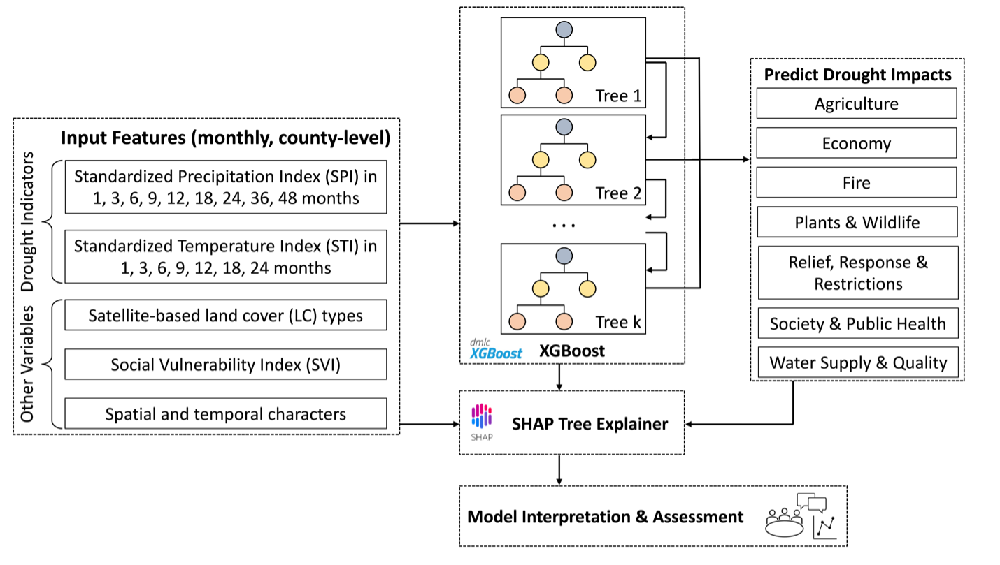
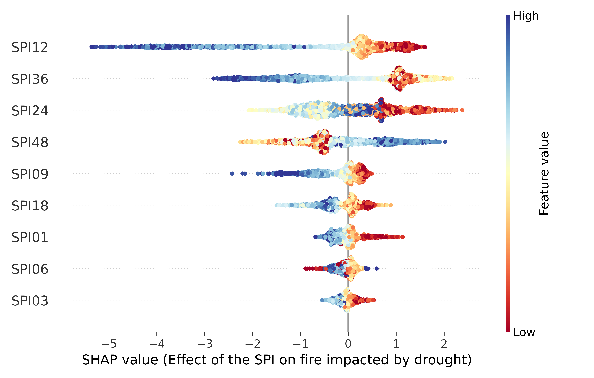
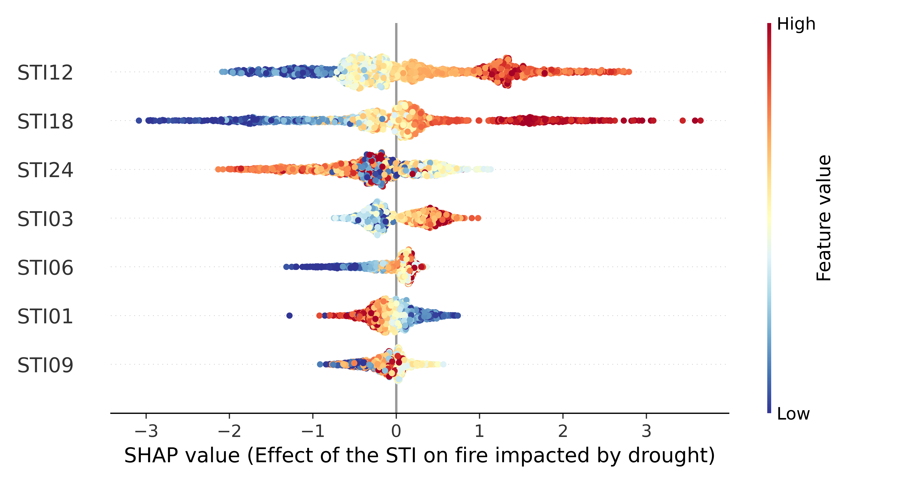
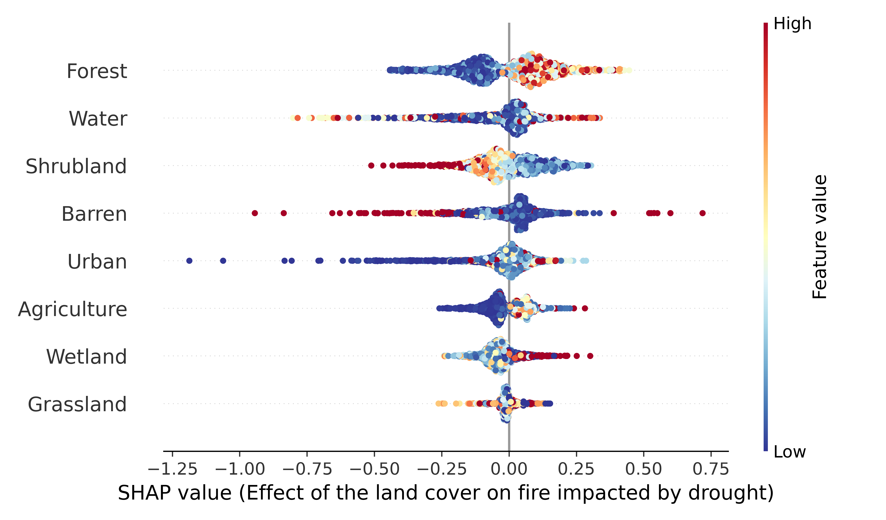
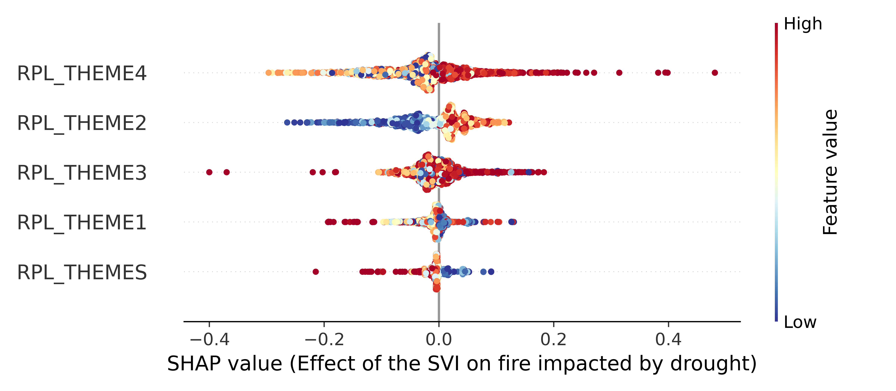

# Explainable Machine Learning for the Prediction and Assessment of Complex Drought Impacts

**Beichen Zhang**, Fatima K. Abu Salem, Michael J. Hayes, Kelly Helm Smith, Tsegaye Tadesse, Brian D. Wardlow

***This study was sbumitted to [Science of the Total Environment (STOTEN)](https://www.sciencedirect.com/journal/science-of-the-total-environment) [IF: 10.75] in February 2023.***

## Abstract

> Drought is a common and costly natural disaster with broad social, economic, and environmental impacts. Artificial intelligence (AI) and machine learning (ML) have been widely and increasingly applied in relative studies because of their outstanding performance on predictive tasks. However, for practical applications like disaster monitoring and assessment, the cost of the model’s failure, especially false negative predictions, might have a significant impact on society. Stakeholders are not satisfied with or do not “trust” the predictions from the models considered as “black boxes”. The explainability of ML models becomes progressively crucial in studying drought and its impacts. Hence, we proposed an explainable ML pipeline using XGBoost and SHAP based on a comprehensive drought impacts database in the U.S. The XGBoost models in the pipeline significantly outperformed the baseline models in predicting the occurrence of multi-dimensional drought impacts. The state- level case studies show that **the Standardized Precipitation Index (SPI) and Standardized Temperature Index (STI) contribute more significantly to predicting drought impacts than land cover types and social vulnerabilities.** The patterns of the SHAP values reveal expected relationships between the SPI variables and drought impacts, in which negative SPI values positively contribute to the occurrence of drought impacts. **The explainability based on the SPI variables improves the trustworthiness of the XGBoost models.** Overall, this study indicates the initial success of applying explainable ML to predicting and assessing complex drought impacts. **The proposed pipeline has promising results in providing accurate predictions of the occurrence of drought impacts and making the relationships between drought impacts and indicators more interpretable. The study also reveals the potential of utilizing explainable ML to help stakeholders better understand the complex drought impacts at the regional level.**

## Graphic Abstract

<p align="center">


<a href="https://arxiv.org/abs/2211.02768"> Preliminary study submitted to the NeurIPS 2020 workshop</a>

<a href="https://www.climatechange.ai/papers/neurips2020/18"> Video from the Tackling Climate Change with Machine Learning</a>

<a href="https://colab.research.google.com/drive/1EVZ3lJBwahy6STyTpQKA1Hsr-wMLKXLd?usp=sharing">Quick Colab Example </a>

------

**The explanation of using this repository can be found at [Notes](docs/Notes.md)**.

## Seven types of drought impacts


| Category                           | Defination                                                   |
| ---------------------------------- | ------------------------------------------------------------ |
| **Agriculture**                    | Drought effects associated with agriculture, farming,  aquaculture, horticulture, forestry, and ranching |
| **Economy**                        | - **Energy**: Drought effects associated with power production, electricity rates, energy revenue, and  purchase of alternate sources of energy.<br />- **Business \& Industry**: Drought effects associated with non-ag businesses. <br />- **Tourism \& Recreation**: Drought effects associated with recreational activities and tourism. |
| **Fire**                           | Drought effects associated with forest, range, and urban fires during drought events. |
| **Plant & Wildlife**               | Drought effects associated with wildlife, fisheries, forests, and other fauna. |
| **Relief, Response & Restriction** | Drought effects associated with disaster declarations, aid programs, requests for disaster declaration or aid, water restrictions, and fire restrictions. |
| **Society \& Public Health**       | Drought effects associated with changes in public behavior and human health effects. |
| **Water Supply \& Quality**        | Drought effects associated with surface or subsurface water supplies. |

## Performance of XGBoost on predicting drought impacts

$F_2$ score on the test dataset at the national level:

|         | Agriculture | Economy   | Fire      | Plant & Wildlife | Relief, Response & Restriction | Society \& Public Health | Water Supply \& Quality |
| ------- | ----------- | --------- | --------- | ---------------- | ------------------------------ | ------------------------ | ----------------------- |
| XGBoost | **0.914**   | **0.881** | **0.876** | **0.899**        | **0.889**                      | **0.868**                | **0.856**               |
| RF      | 0.797       | 0.723     | 0.724     | 0.759            | 0.771                          | 0.765                    | 0.733                   |
| LR      | 0.678       | 0.716     | 0.599     | 0.621            | 0.640                          | 0.566                    | 0.592                   |
| SVM     | 0.351       | 0.024     | 0.127     | 0.265            | 0.249                          | 0.117                    | 0.062                   |
| OneR    | 0.248       | 0.123     | 0.094     | 0.083            | 0.164                          | 0.133                    | 0.083                   |

## Interpretation of the XGBoost model of drought impacts related to fire in California

<p align="center">








*Illustration of the interpretations from the SHAP values is thoroughly discussed in the article.*

## Citation


If you find this study might help your research, please consider citing the following paper:

```tex
@inproceedings{xgboost_drought_impacts,
	title = {Quantitative Assessment of Drought Impacts Using XGBoost based on the Drought Impact Reporter},
	url = {https://arxiv.org/abs/2211.02768},
	booktitle = {Tackling {Climate} {Change} with {Machine} {Learning} {Workshop}, 34th {Conference} on {Neural} {Information} {Processing} {Systems} ({NeurIPS} 2020)},
	author = {Zhang, Beichen and Salem, Fatima K. Abu and Hayes, Michael J. and Tadesse, Tsegaye},
	year = {2022},
	doi = {10.48550/ARXIV.2211.02768}
}
```

